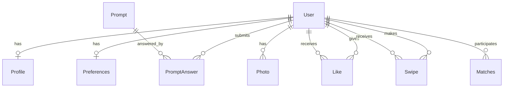

# Database Schema Documentation

## Database Overview

The application uses **PostgreSQL** as the database with **Prisma ORM** for data management. The database is structured to support a complete dating app experience with user profiles, preferences, photos, prompts, likes, and swipe tracking.

---

## Models and Relationships

### **User Model**

Primary entity representing a registered user in the system.

```prisma
model User {
  id               String      @id @default(cuid())
  walletPubKey     String      @unique           // Solana wallet public key
  isActive         Boolean     @default(true)
  createdAt        DateTime    @default(now())
  updatedAt        DateTime    @updatedAt
  lastActiveAt     DateTime?                     // For sorting suggestions by activity

  isVerified       Boolean     @default(false)   // Verified user status
  isPremium        Boolean     @default(false)   // Premium subscription status

  // Relations
  profile          Profile?                      // One-to-one with Profile
  preferences      Preferences?                  // One-to-one with Preferences
  photos           Photo[]                       // One-to-many with Photos
  likesGiven       Like[]      @relation("UserLikes")       // Likes this user gave
  likesReceived    Like[]      @relation("UserLikedBy")     // Likes this user received
  promptAnswers    PromptAnswer[]                // User's prompt answers
  matchesAsFirst   Matches[]   @relation("MatchFirst")      // Matches where user is first
  matchesAsSecond  Matches[]   @relation("MatchSecond")     // Matches where user is second
  swipesGiven      Swipe[]     @relation("UserSwipes")      // Swipes this user made
  swipesReceived   Swipe[]     @relation("UserSwipedOn")    // Swipes received

  @@index([walletPubKey])
  @@index([lastActiveAt])
}
```

**Fields:**

| Field | Type | Description |
|-------|------|-------------|
| `id` | String | Unique identifier (CUID) |
| `walletPubKey` | String | Unique Solana wallet address (indexed) |
| `isActive` | Boolean | Account status (default: true) |
| `createdAt` | DateTime | Account creation timestamp |
| `updatedAt` | DateTime | Last update timestamp (auto) |
| `lastActiveAt` | DateTime? | Last activity timestamp (for suggestion sorting) |
| `isVerified` | Boolean | User verification status (default: false) |
| `isPremium` | Boolean | Premium subscription status (default: false) |

---

### **Profile Model**

Stores user's personal and dating profile information.

```prisma
model Profile {
  id           String   @id @default(cuid())
  userId       String   @unique              // One-to-one relationship
  user         User     @relation(fields: [userId], references: [id], onDelete: Cascade)

  displayName  String                        // Display name
  age          Int                           // Age (indexed for search)
  gender       Gender                        // Gender enum (indexed)
  orientation  String                        // Sexual orientation
  bio          String?                       // Biography (optional)
  profession   String?                       // Job/profession (optional)
  hobbies      String[] @default([])         // Array of hobbies
  religion     String?                       // Religion (optional)
  country      String?                       // Country (indexed) e.g., "India"
  state        String?                       // State/Region (indexed) e.g., "Maharashtra"
  city         String?                       // City (optional) e.g., "Mumbai"
  heightCm     Int?                          // Height in cm (optional)

  @@index([age])
  @@index([gender])
  @@index([country])
  @@index([state])
  @@index([orientation])
}
```

**Fields:**

| Field | Type | Required | Description |
|-------|------|----------|-------------|
| `displayName` | String | ✅ | User's display name |
| `age` | Int | ✅ | User's age in years |
| `gender` | Gender | ✅ | User's gender (enum) |
| `orientation` | String | ✅ | Sexual orientation |
| `bio` | String? | ❌ | Profile biography |
| `profession` | String? | ❌ | Job/profession |
| `hobbies` | String[] | ❌ | Array of hobby strings |
| `religion` | String? | ❌ | Religion |
| `country` | String? | ❌ | Country (validated) |
| `state` | String? | ❌ | State/Region (validated) |
| `city` | String? | ❌ | City |
| `heightCm` | Int? | ❌ | Height in centimeters |

---

### **Preferences Model**

Stores user's matching preferences and filters.

```prisma
model Preferences {
  id               String        @id @default(cuid())
  userId           String        @unique
  user             User          @relation(fields: [userId], references: [id], onDelete: Cascade)

  preferredGenders Gender[]      @default([])     // Array of preferred genders
  ageMin           Int?                           // Minimum age preference
  ageMax           Int?                           // Maximum age preference
  locationScope    LocationScope @default(SAME_STATE)  // Location matching scope
}
```

**Fields:**

| Field | Type | Default | Description |
|-------|------|---------|-------------|
| `preferredGenders` | Gender[] | [] | Preferred gender(s) for matching |
| `ageMin` | Int? | null | Minimum age preference |
| `ageMax` | Int? | null | Maximum age preference |
| `locationScope` | LocationScope | SAME_STATE | How far to search for matches |

---

### **Swipe Model**

Tracks all swipe actions (likes and passes). This is the primary model for all swipe interactions.

```prisma
model Swipe {
  id         String      @id @default(cuid())
  fromUserId String                           // User who swiped
  toUserId   String                           // User who was swiped on
  action     SwipeAction                      // LIKE or PASS
  createdAt  DateTime    @default(now())

  fromUser   User        @relation("UserSwipes", fields: [fromUserId], references: [id], onDelete: Cascade)
  toUser     User        @relation("UserSwipedOn", fields: [toUserId], references: [id], onDelete: Cascade)

  @@unique([fromUserId, toUserId])            // One swipe per user pair
  @@index([toUserId])
}
```

**Purpose:**
- Tracks all user swipe actions (LIKE and PASS)
- Prevents showing already-swiped users in suggestions
- Used to get "who liked me" list (filter by action=LIKE)
- Match detection: mutual swipes where both are LIKE
- Future: Can add REPORT action for blocking users

---

### **Photo Model**

Stores user profile photos.

```prisma
model Photo {
  id       String  @id @default(cuid())
  userId   String                               // Many-to-one with User
  user     User    @relation(fields: [userId], references: [id], onDelete: Cascade)
  url      String                               // Photo URL
  order    Int                                  // Display order (0 = primary)

  @@index([userId])
}
```

---

### **Prompt Model**

Pre-defined prompts/questions for user profiles (admin-controlled).

```prisma
model Prompt {
  id          String         @id @default(cuid())
  question    String                            // The prompt question
  category    PromptCategory                    // Category enum
  isActive    Boolean        @default(true)     // Active status
  order       Int?                              // Display order
  createdAt   DateTime       @default(now())

  answers     PromptAnswer[]                    // User answers
}
```

---

### **PromptAnswer Model**

User's answers to profile prompts.

```prisma
model PromptAnswer {
  id         String   @id @default(cuid())
  userId     String
  promptId   String
  answer     String                             // User's answer
  createdAt  DateTime @default(now())

  user       User     @relation(fields: [userId], references: [id], onDelete: Cascade)
  prompt     Prompt   @relation(fields: [promptId], references: [id], onDelete: Cascade)

  @@unique([userId, promptId])                  // One answer per prompt per user
}
```

---

### **Like Model**

Represents likes between users.

```prisma
model Like {
  id           String   @id @default(cuid())
  fromUserId   String                           // User who liked
  toUserId     String                           // User who was liked
  createdAt    DateTime @default(now())

  fromUser     User     @relation("UserLikes", fields: [fromUserId], references: [id], onDelete: Cascade)
  toUser       User     @relation("UserLikedBy", fields: [toUserId], references: [id], onDelete: Cascade)

  @@unique([fromUserId, toUserId])              // Prevent duplicate likes
  @@index([toUserId])                           // Index for received likes
}
```

---

### **Matches Model**

Stores mutual matches between users. Created when both users swipe LIKE on each other.

```prisma
model Matches {
  id             String   @id @default(cuid())
  firstPersonId  String                         // First user in the match
  secondPersonId String                         // Second user in the match
  createdAt      DateTime @default(now())

  firstPerson    User     @relation("MatchFirst", fields: [firstPersonId], references: [id], onDelete: Cascade)
  secondPerson   User     @relation("MatchSecond", fields: [secondPersonId], references: [id], onDelete: Cascade)

  @@unique([firstPersonId, secondPersonId])     // One match per user pair
}
```

---

## Database Relationships Diagram



```
User (1) ←→ (1) Profile
User (1) ←→ (1) Preferences
User (1) ←→ (N) Photo
User (1) ←→ (N) PromptAnswer
User (1) ←→ (N) Swipe (as fromUser - swipes given)
User (1) ←→ (N) Swipe (as toUser - swipes received / who liked me)
User (1) ←→ (N) Matches (as firstPerson)
User (1) ←→ (N) Matches (as secondPerson)
Prompt (1) ←→ (N) PromptAnswer
```

---

## Enums

### Gender
```typescript
enum Gender {
  MALE = 'MALE',
  FEMALE = 'FEMALE',
  NON_BINARY = 'NON_BINARY',
  OTHER = 'OTHER'
}
```

### LocationScope
```typescript
enum LocationScope {
  SAME_CITY = 'SAME_CITY',       // Match only users in same city
  SAME_STATE = 'SAME_STATE',     // Match users in same state (default)
  SAME_COUNTRY = 'SAME_COUNTRY', // Match users in same country
  ANY = 'ANY'                    // No location filtering
}
```

### PromptCategory
```typescript
enum PromptCategory {
  FUN = 'FUN',
  LIFESTYLE = 'LIFESTYLE',
  VALUES = 'VALUES',
  ICEBREAKER = 'ICEBREAKER'
}
```

### SwipeAction
```typescript
enum SwipeAction {
  LIKE = 'LIKE',   // User liked the profile
  PASS = 'PASS'    // User passed/rejected the profile
}
```

---

## Indexes

| Model | Field | Purpose |
|-------|-------|---------|
| User | `walletPubKey` | Fast wallet-based lookup |
| User | `lastActiveAt` | Sorting by activity |
| Profile | `age` | Age range queries |
| Profile | `gender` | Gender-based filtering |
| Profile | `country` | Location-based searches |
| Profile | `state` | Location-based searches |
| Profile | `orientation` | Orientation filtering |
| Photo | `userId` | Fetching user photos |
| Swipe | `toUserId` | Fetching received likes, filtering swiped users |

---

## Location Validation

Location fields are validated against a constants file at `apps/dating-backend/src/constants/locations.ts`.

**Supported Countries:** India, USA, UK, Canada, Australia

**Validation Functions:**
- `validateLocation(country, state)` - Validates country/state combination
- `getStates(country)` - Returns valid states for a country
- `isValidCountry(country)` - Checks if country is valid
- `isValidState(country, state)` - Checks if state is valid for country

---

## Database Access

| Item | Path |
|------|------|
| Prisma Client | `packages/database/src/client.ts` |
| Schema File | `packages/database/prisma/schema.prisma` |
| Migrations | `packages/database/prisma/migrations/` |
| Generated Types | `packages/database/src/generated/prisma/` |

---

## Cascade Deletes

All relations use `onDelete: Cascade` which means:
- Deleting a **User** automatically deletes their Profile, Preferences, Photos, Likes, Swipes, PromptAnswers, and Matches
- Deleting a **Prompt** automatically deletes all PromptAnswers for that prompt

---

## Frontend TypeScript Types

For complete TypeScript types to use in the frontend, see [API_DOCUMENTATION.md](./API_DOCUMENTATION.md#typescript-types-for-frontend).
